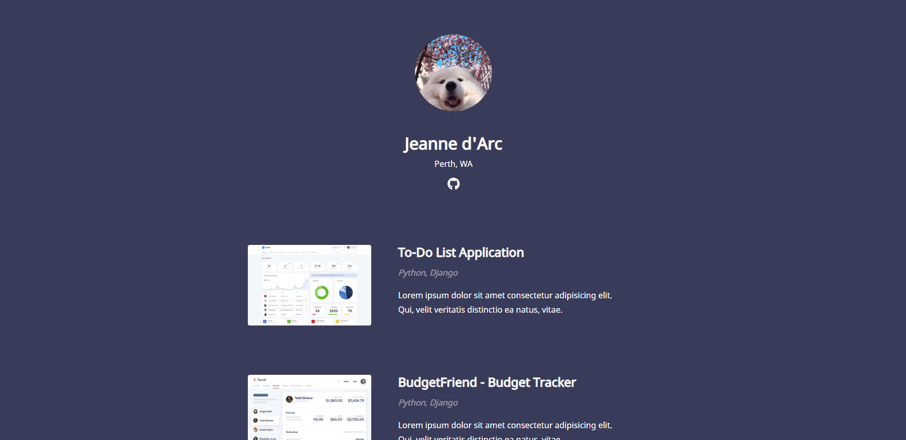

# simple-portfolio-template

 Simple portfolio site for Github Pages

## Installation
1. Fork this project (top right button)
2. You will be taken to your forked version - go to `Settings`
3. Change **Repository name** to `username.github.io` where `username` is your GitHub username 
4. Going to `http://username.github.io` will now show the portfolio

## Editing
If you are new to editing repositories, it is recommended to install [GitHub Desktop](https://desktop.github.com/).
1. `File > Clone Repository`
2. Select the fork you created in the installation step
3. After successfully cloning, go to `Repository > Show in Explorer`
4. Those are the files, edit them as you wish
5. When finished editing, use GitHub Desktop to `Commit to master`
6. Click `Push origin` at the top right to submit it to the internet
7. The updates will now be live